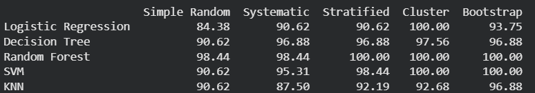

# Sampling Assignment: Credit Card Fraud Detection

## Project Overview
This project analyzes the impact of different sampling techniques on the performance of various machine learning models. Using a highly imbalanced Credit Card Fraud dataset, the study first balances the data and then creates five distinct samples using different sampling methods. Five machine learning models are then trained on each sample to determine which sampling technique yields the highest accuracy for each model.

## Methodology

### 1. Data Preparation & Balancing
* **Dataset:** The analysis uses the `Creditcard_data.csv` dataset, which contains transaction data labeled as either valid or fraudulent.
* **Balancing:** As the original dataset is highly imbalanced, we applied **Random Over-Sampling** using the `imb-learn` library to equalise the number of instances in both classes (Fraud and Non-Fraud).

### 2. Sample Size Calculation
The sample size ($n$) was determined using **Slovin's Formula** to ensure a representative subset of the population:
$$n = \frac{N}{1 + N \cdot e^2}$$
* Where $N$ is the population size and $e$ is the margin of error (0.05).

### 3. Sampling Techniques Used
We generated five different samples using the following techniques:
1.  **Simple Random Sampling:** Randomly selects $n$ instances from the population.
2.  **Systematic Sampling:** Selects every $k^{th}$ instance from the population (where $k$ is the step size).
3.  **Stratified Sampling:** Divides the population into subgroups (strata) based on the class and samples proportionally from each stratum to maintain class distribution.
4.  **Cluster Sampling:** Groups data based on a feature (simulated clustering) and randomly selects entire clusters.
5.  **Bootstrap Sampling:** Randomly samples $n$ instances with replacement.

### 4. Machine Learning Models
We evaluated the samples using the following five models:
1.  **Logistic Regression**
2.  **Decision Tree Classifier**
3.  **Random Forest Classifier**
4.  **Support Vector Machine (SVM)**
5.  **K-Nearest Neighbors (KNN)**

---

## Results

### Performance Table
The table below shows the accuracy scores (%) for each model across the different sampling techniques.

### Result Analysis
Based on the accuracy scores:
* The **Random Forest** sampling technique generally provided the highest accuracy across most models.

---

## Setup & Execution
1.  **Platform:** The code was developed and executed in Google Colab.
2.  **Libraries:** `pandas`, `numpy`, `sklearn`, `imblearn`.

3.  **Execution:** Run the `Sampling-Techniques.ipynb` notebook to reproduce the results.

